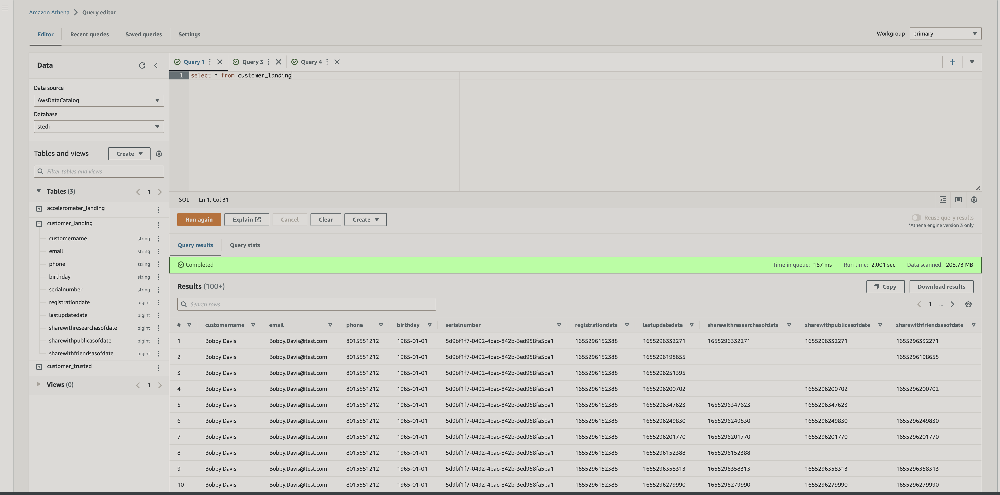
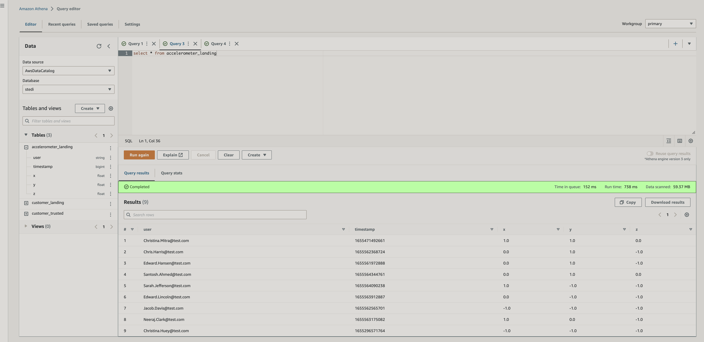
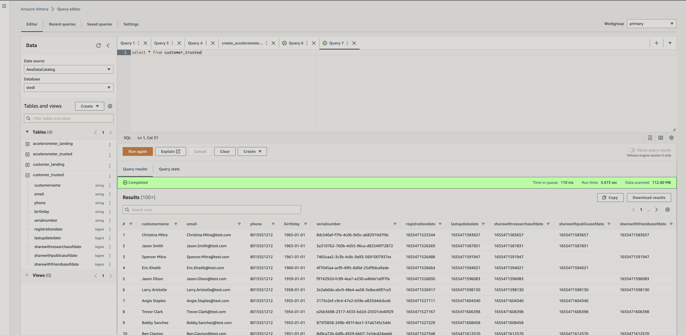
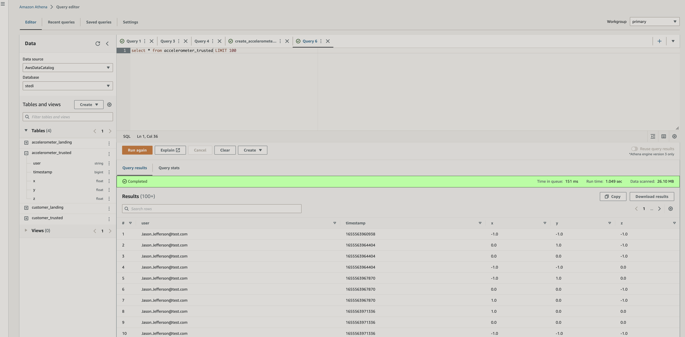

# Project: STEDI Human Balance Analytics

## Overview
Using AWS Glue, AWS S3, Python, and Spark, create or generate Python scripts to build a lakehouse solution in AWS 

### Project Data
STEDI has three JSON data sources to use from the Step Trainer. You can [download](https://video.udacity-data.com/topher/2022/June/62be2ed5_stedihumanbalanceanalyticsdata/stedihumanbalanceanalyticsdata.zip) the data from here or you can extract it from their respective public S3 bucket locations:

1. Customer Records (from fulfillment and the STEDI website):

AWS S3 Bucket URI - s3://cd0030bucket/customers/

contains the following fields:

serialnumber
sharewithpublicasofdate
birthday
registrationdate
sharewithresearchasofdate
customername
email
lastupdatedate
phone
sharewithfriendsasofdate
2. Step Trainer Records (data from the motion sensor):

AWS S3 Bucket URI - s3://cd0030bucket/step_trainer/

contains the following fields:

sensorReadingTime
serialNumber
distanceFromObject
3. Accelerometer Records (from the mobile app):

AWS S3 Bucket URI - s3://cd0030bucket/accelerometer/

contains the following fields:

timeStamp
serialNumber
x
y
z

### ETL Process  

#### Landing Zone
- Use Glue Studio to ingest data from an S3 bucket
    - customer landing endpoint : [s3://stedi-lake/customer/landing/](https://console.aws.amazon.com/s3/buckets/stedi-lake/customer/landing/?region=us-east-1)
    
    - accelerometer landing enpoint: [s3://stedi-lake/accelerometer/landing](https://console.aws.amazon.com/s3/buckets/stedi-lake/accelerometer/landing/?region=us-east-1)
    

#### Trusted Zone
- Use Glue jobs in AWS Glue Studio to process data:
    - customer_landing_to_trusted.py: only store the Customer Records who agreed to share their data for research purposes
    
    - accelerometer_landing_to_trusted.py: only store Accelerometer Readings from customers who agreed to share their data for research purposes 
    
    - step_trainer_trusted.py: contain the Step Trainer Records data for customers who have accelerometer data and have agreed to share their data for research

#### Curated Zone
- Use Glue jobs in AWS Glue Studio to process data:
    - customer_curated.py : only store the Customer Records who agreed to share their data for research purposes and have accelerometer data
    - machine_learning_curated.py : A Python script using Spark that creates an aggregated table that has each of the Step Trainer readings, and the associated accelerometer reading data for the same timestamp, but only for customers who have agreed to share their data, and populates a glue table called machine_learning_curated.